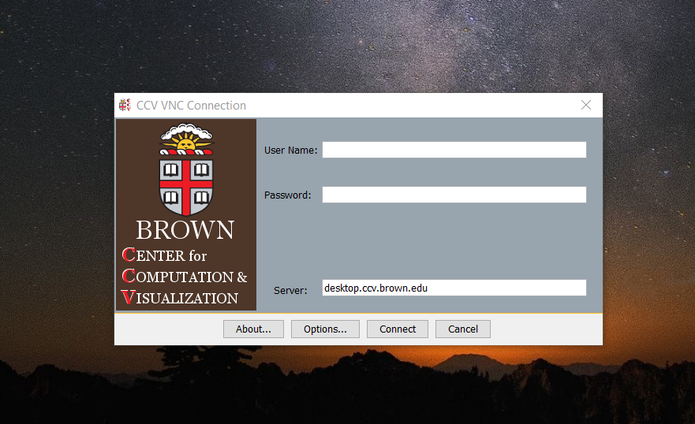
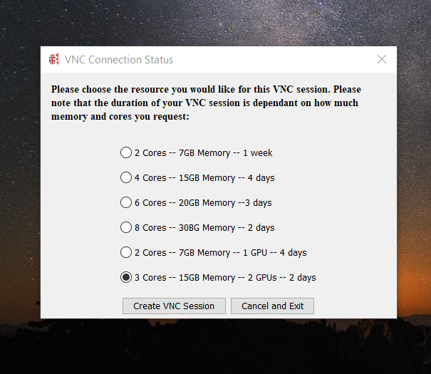
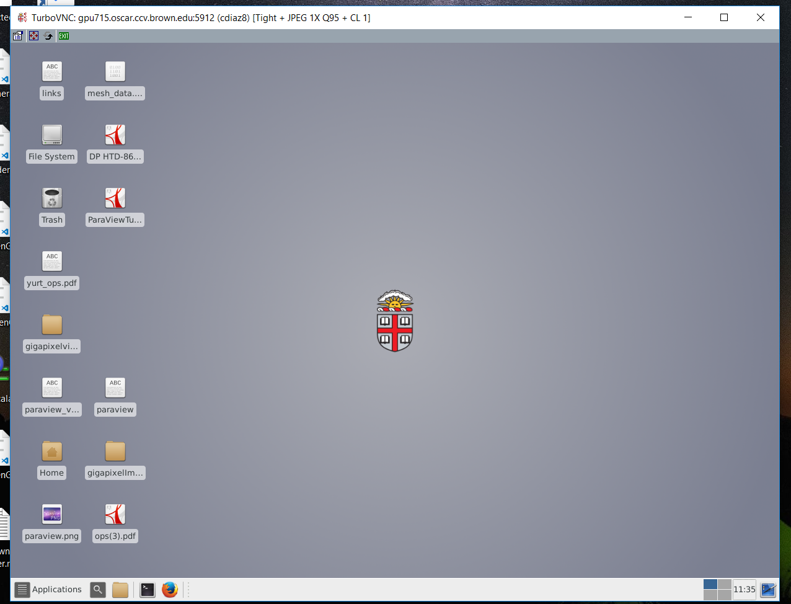

# Fiji \( Fiji Is Just ImageJ \)

### Download

Go to the official site and download the version that works on your current operational system \(Windows, Mac or Linux\). It requires Java. Please upgrade to the latest version.


[https://imagej.net/Fiji/Downloads](https://imagej.net/Fiji/Downloads)


#### 

### Open Fiji

#### On your personal computer.

The location of the executable may vary depending on the fiji version you are going to use. For version 2020, double click on:


```text
path_to_fiji_folder/Fiji.app/ImajeJ-Windows64
or
path_to_fiji_folder/Fiji.app/ImajeJ-Linux64
or
path_to_fiji_folder/Fiji.app/ImajeJ-MacOs
```

#### On Oscar

Applications that require a graphics UI  \( window  \) needs a visual/interactive interface to work with. If you want to use the installed version of Fiji in Oscar you have to open a VNC session.

1.  Go to [https://web1.ccv.brown.edu/technologies/vnc](https://web1.ccv.brown.edu/technologies/vnc) and download [CCV VNC client 2.0.2](https://brownbox.brown.edu/download.php?hash=fe8b9a93)
2. Doble click on the CCV\_VNC\_2.0.1.jar



1. Use your ccv user and password \(usually are the same brown credentials\)
2. In the following pop up window select the last option \( 3 Cores - 15 GB Memory 2 GPU\) and click on ‘Create VNC Session’’



 Wait a few seconds \(at least 60 seconds\) to get the virtual desktop



**Opening Fiji UI**

1. Open terminal: Applications - &gt; Utilities -&gt; Terminal \(this might differ depending on the Operating System UI\)
2. Run the command

$ module load fiji/2020

  3. Run the command

$ ImageJ-linux64

You will see the Fiji Window


### Tutorials

For instructions on how to use the basic functionalities please follow the guide at:

```text
https://imagej.net/Learn
```

Also, You can follow this video playlist from the Melbourne Advanced Microscopy Facility.


```text
https://www.youtube.com/watch?v=1ZR3eztlvLo&list=PLvHJ_gpVJo-S9VIkZ7XJIYll3zpQoL0L7
```

### Data Examples

Fiji has a list of data samples you can play with. They are located at.

```text
https://imagej.nih.gov/ij/images/
```


