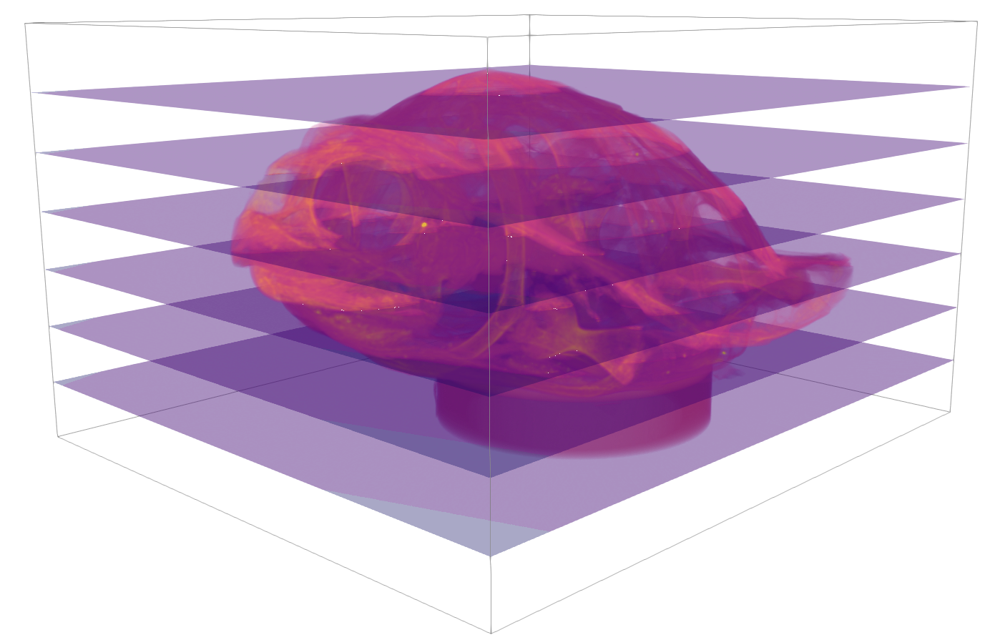

# BigDataViewer

You can find the official documentation of the plugin in the following link.

```text
https://imagej.net/BigDataViewer.html
```

Here, We will follow a brief example describing the steps to work with large datasets in Fiji.

### Stacks / Virtual Stacks

Datasets could be represented as a set of 2D images \(width and height\) which stacked together form an extra dimension giving the appearance of  a 3D structure. This is what is call a stack dataset



Image stacks have a specific resolution per image, which represents how much information is stored. Depending on how large is the data, it could affect the performance of the computer you work with.  Any dataset below the 200 MB can fit into RAM without having a bad impact in your workstation. However, nowadays data produced from new generation microscopes \( light-sheet microscopy \) can be in the order of TBs \(1 Terabyte =1024 GB  = 1e+6 MB\). If we want to analyze these data, then we need whether more computational power or a workaround to NOT loading all the stack at once into RAM.

ImageJ has a concept call [virtual stacks](https://imagej.nih.gov/ij/plugins/virtual-opener.html). It allows image sequences too big to fit in RAM to be opened but image access time is slower and changes are lost when you switch to another image.

If you have a large image stack in any kind of format \(tiff, jpeg\), in order to open it go to File -&gt; Import -&gt; Image Sequence.


Select the first image of the sequence, in the pop up window check the box virtual stack and click ok.


You can navigate the stack using the slide below the resulting image.


### Converting to HDF5

Now, going back to BigDataViewer. This plugin works with custom format specialized for large datasets is based on XML and HDF5.  We want to convert our image stack to that format. In the menu bar do click on Plugins -&gt; BigDataViewer -&gt; Export Current Image as XML/HDF5.


Keep the deflate compression and select the path you want the resulting XML file.


