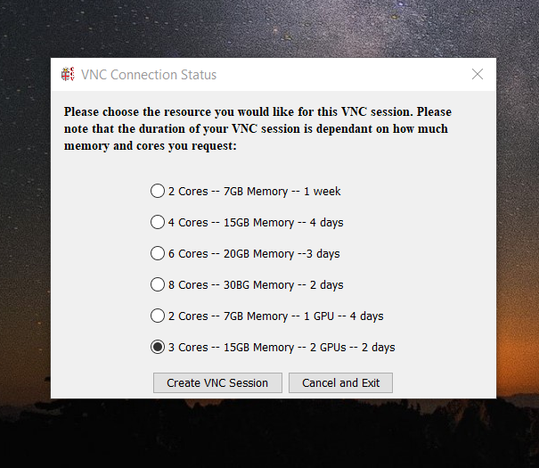
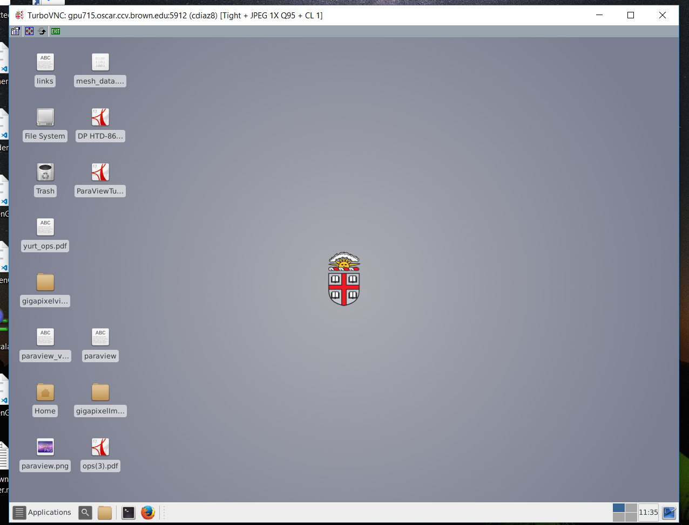

# Remote Rendering


_You might affect other users in the system. To avoid it, please email to support@ccv.brown.edu requesting access to the **BROWN YURT Calendar** and check the system availability_


_Paraview Tutorial_

**Getting VNC**

1.  Go to [https://web1.ccv.brown.edu/technologies/vnc](https://web1.ccv.brown.edu/technologies/vnc) and download [CCV VNC client 2.0.2](https://brownbox.brown.edu/download.php?hash=fe8b9a93)
2. Doble click on the CCV\_VNC\_2.0.1.jar

1. Use your ccv user and password \(usually are the same brown credentials\)
2. In the following pop up window select the last option \( 3 Cores - 15 GB Memory 2 GPU\) and click on ‘Create VNC Session’’

 Wait a few seconds \(at least 60 seconds\) to get the virtual desktop

**Opening Paraview UI**

1. Open terminal: Applications - &gt; Utilities -&gt; Terminal \(this might differ depending on the Operating System UI\)
2. Run the command

$ module load paraview/5.6.0\_no\_scalable

Read the pop up message “module load mpi/cave\_mvapich2\_2.3rc2\_gcc before launching paraview”

It means, on the terminal run the following command:

$ module load mpi/cave\_mvapich2\_2.3rc2\_gcc

1. Run the command

 $ paraview\_ui

\(it will take some minutes if it’s the first time opening paraview, don't despair\)

 After a while you’ll see on screen paraview ui:

**Connecting to the remote server**

This step will reset the scene, so before doing it make sure to save all your data.

1. In paraview UI go to menu bar File -&gt; Connect ..

1. A. If you find a connection named **Remote rendering**. click ‘connect’

B. Otherwise go to ‘Add Server’:

name the connection ‘Remote Rendering’’, select Server type ‘Client / Server’, Host : cave001, Port: **11111**, click ‘Configure’ button

In the next screen, select Startup Type : Command. In the Text field area paste the following command:

 /gpfs/runtime/opt/paraview/5.6.0\_no\_scalable/bin/run\_pserver

Click ‘Save’.

Select the new created connection and click ‘Connect’

 After a few seconds, you get connected to the HPC automatically

**Loading Data**

There are data examples you can test with paraview.

1. Go to File -&gt; Open
2. Go to the following path:

/gpfs/runtime/opt/paraview/5.6.0\_no\_scalable/TestData/Data

1. Select bunny.ply or any other file \(some of them do not load properly and the application might crash, you’ll have to open paraview ui again and reconnect to the server\)
2. You might have to apply the latest changes into the scene. At the left side of the UI go to the “Properties” tab and click “apply”

**Disconnecting from the remote server**

This step will reset the scene, so before doing it make sure to save all your data.

1. In paraview UI go to menu bar File -&gt; Disconnect ..

In the follow pop window click ok.

