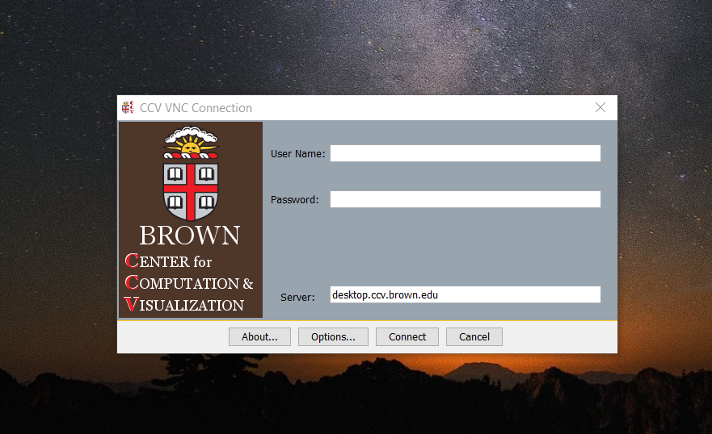

# Remote Rendering Server


In order to follow this guide, you need access to Brown University's HPC system "Oscar". Please refer to the official [ccv website](https://ccv.brown.edu/) and go to the Documentation section where you can find all the help related on how to connect and use it.


The Center for Computation and Visualization offers to the academic community a way to visualize datasets using Oscar and its powerful GPUs as a rendering server. The current hardware at the HPC surpass the common desktop models, offering a modern an robust solution to display large datasets in parallel jobs using the widely used  opensource software [Paraview](https://www.paraview.org/). It is a simple "two steps" process. Start the server and connect the client.

## Start the server

You need to allocate the resources via slurm indicating the number of CPUs, GPUs and the amount of memory you want to run the server with. Luckily, there is a program in Oscar that facilitates this request.

`run-remote-server -u your_brown_email@brown.edu`

By default, the script request 4 CPUs, 4 GPUs and 30G of RAM. But you can modify these by adding more parameters to the command.

`usage: run-remote-render [-n cores] [-t walltime] [-m memory] [-q queue] [-o outfile] [-g ngpus] [-u user brown email]  
Allocates resources, start up the render server and send and email to the user requesting the service  
options:   
-c cores (default: 4)   
-t walltime as hh:mm:ss (default: 1:30:00)   
-m memory as #[k|m|g] (default: 30G)   
-o outfile save a copy of the session's output to outfile (default: off)  
-g ngpus (default 4)  
-u brown email of the user requesting the service`

As the command executes as a batch job that will get resources when they are available, an email is sent to the user indicating that the service is running and the IP address you need to connect to. 

`Your PVSERVER connection is ready  
 Your connection to paraview server is ready at: gpu1210.oscar.ccv.brown.edu:1111`  
  
The message indicates you have to connect to the server `gpu1210.oscar.ccv.brown.edu` through the port `11111` . 

## Connect to the server

### **Using your desktop computer \(Recommended\)**

Go to the official [Paraview Download website](https://www.paraview.org/download/). Select your Operational system \(Linux, Windows or Mac\) and get the file `ParaView-5.8.0-Windows-Python3.7` . Install in your environment, go to the installation directory and open Paraview.

#### Setting up Connection Tunneling.

If your local machine is not connected directly to the brown network, you have to follow this part.  
Open a terminal and execute the command:

`ssh -N -L 11111:SERVER_IP:11111 your_brown_id@ssh.ccv.brown.edu`

where `SERVER_IP` is the ip sent in the email and `your_brown_id` is your Brown username \(It should be the same used to connect to the wi-fi\)  
After typing  your credentials, you will notice the terminal command line hangs. That is normal, it indicates you are connected and the tunneling is set up.

**Connecting to the remote server**

This step will reset the scene, so before doing it make sure to save all your data.

1. In paraview UI go to menu bar File -&gt; Connect ..

A. If you find a connection named **Remote rendering**. click ‘connect’

B. Otherwise go to ‘Add Server’:

name the connection ‘Remote Rendering’’, select Server type ‘Client / Server’,**.**  
The host is the IP sent in the email. In our example is **`localhost`** , and the port `11111`

In the next screen, select Startup Type : Manual. Click on Save, select the new created connection and click ‘Connect’

 After a few seconds, you get connected to the HPC automatically.

### Using  VNC Virtual Desktop

1.  Go to [https://web1.ccv.brown.edu/technologies/vnc](https://web1.ccv.brown.edu/technologies/vnc) and download [CCV VNC client 2.0.2](https://brownbox.brown.edu/download.php?hash=fe8b9a93)
2. Doble click on the CCV\_VNC\_2.0.1.jar

1. Use your ccv user and password \(usually are the same brown credentials\)
2. In the following pop up window select the last option \( 3 Cores - 15 GB Memory 2 GPU\) and click on ‘Create VNC Session’’

 Wait a few seconds \(at least 60 seconds\) to get the virtual desktop

**Opening Paraview UI**

1. Open terminal: Applications - &gt; Utilities -&gt; Terminal \(this might differ depending on the Operating System UI\)
2. Run the commands

$ module load paraview/5.8.0

$module load mpi/openmpi\_4.0.4\_gcc

 $ paraview\_ui

\(it will take some minutes if it’s the first time opening paraview, don't despair\)

 After a while you’ll see on screen paraview ui:

**Connecting to the remote server**

This step will reset the scene, so before doing it make sure to save all your data.

1. In paraview UI go to menu bar File -&gt; Connect ..

1. A. If you find a connection named **Remote rendering**. click ‘connect’

B. Otherwise go to ‘Add Server’:

name the connection ‘Remote Rendering’’, select Server type ‘Client / Server’,**.**  
The host is the IP sent in the email. In our example is `gpu1210.oscar.ccv.brown.edu`  , and the port `11111`

In the next screen, select Startup Type : Manual. Click on Save, select the new created connection and click ‘Connect’

 After a few seconds, you get connected to the HPC automatically.

### \*\*\*\*

### Verifying the connection is set up correctly.

In Paraview UI go to the menu bar "View" and select "Memory Inspector". You will notice a list of servers indicating the number of processes running on them

## Summary

1.  Open a terminal an connect to Oscar \(Follow [this link](https://docs.ccv.brown.edu/oscar/getting-started) to know how to do it\)
2.  Execute the command `run-remote-server -u your_brown_email@brown.edu`.
3.  Wait for the email indicating the server is running 
4. Connect to the server using Paraview Client

If you find any issues following this guide or require additional help, do not hesitate contacting ccv services at `support@ccv.brown.edu`

