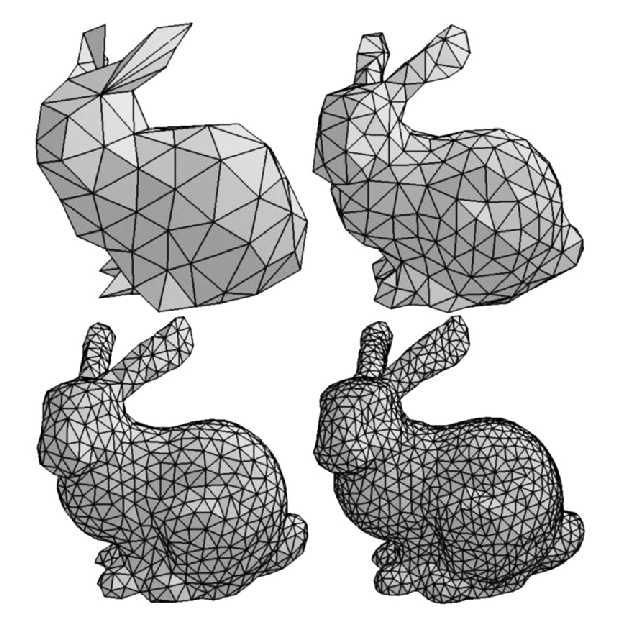
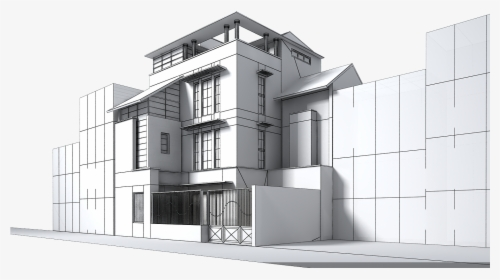
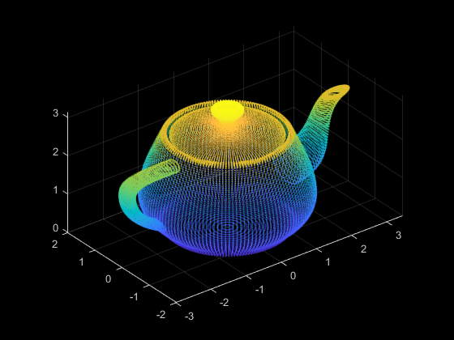
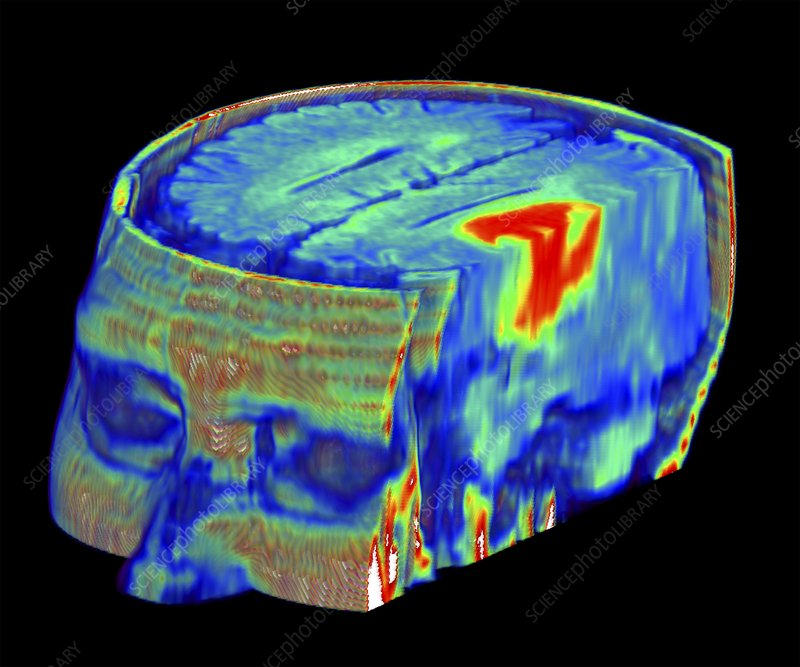
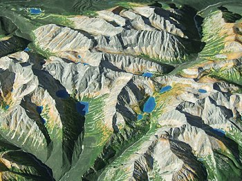
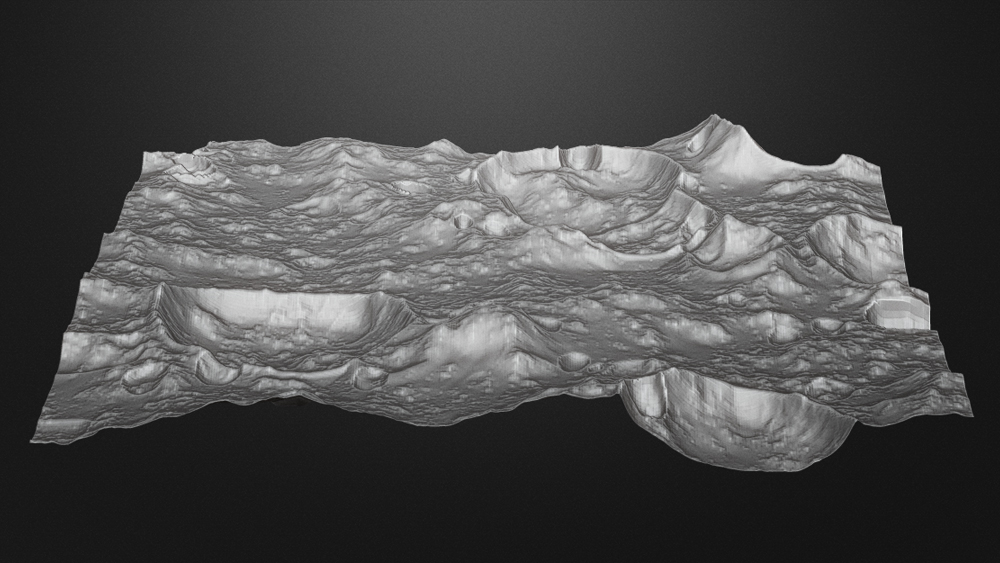

# 3D DataSets

### 3D Data

Contrary to its two dimensional counter part, three-dimensional \(3D\) data comes in several shapes.

* Meshes: It is structural build of a 3D model based on polygons. Every point in a mesh represents a point in space called vertex. This point is connected to  two or more vertices creating a base geometry shape such as triangles and quads. Connecting multiple triangles together, they form a three dimensional structure that can be displayed on a monitor.

* Point Cloud: It's a set of georeferenced points.  They ****provide high-resolution data without the distortion sometimes present in 3D mesh models and are commonly used in industry-standard software.

* Volume data: in a nutshell, it is a set of 2D sliced images that stack together forming a regular pattern assembling a 3D structure. Most of the time this type of data is acquired by a CT, MRI, or MicroCT scanner. 

* Height elevation data: This type of data is used to display terrains. Usually one of the channels in the data contains information on a displacement or height from the floor of a surface.

###  3D data software

1. [Paraview](https://www.paraview.org/)
2. [Imaris](https://imaris.oxinst.com/) \(Licensed\)
3. [Blender](https://www.blender.org/)
4. [Inkscape](https://inkscape.org/)
5. [Open Scene Graph](http://www.openscenegraph.org/)
6. [SDL](https://www.libsdl.org/)
7. [AutoDesk Maya](https://www.autodesk.com/products/maya/overview?support=ADVANCED) \(Licensed\)
8. [MinVR](https://github.com/MinVR/MinVR)
9. [BioBlender](http://www.bioblender.org/)
10. [Rino 3D](https://www.rhino3d.com/) \(Licensed\)

