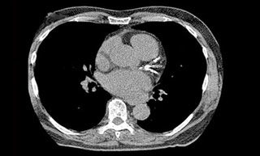

# 2D DataSets

### 2D Data

Most of the times they represent histograms \(how often a value appears in a range of data\) and images. The former is a set of numbers that can be studied using databases and statistical software. The latter will be our case of study. Images are two dimensional arrays of bits that store information about the color of an specific point. The minimum unit of an image is called pixel which has the RGB values of the point's color. Each RGB values is a number in the range from 0 to 255. Here, we have  examples of images with data from a section of heart and the brain.

One additional aspect of 2D images is the color scale. Briefly explained, Color Space is a numerical representation of range of colors that a projector or monitor could create. Due to the many requirements for artists, printers and computer generated effects, the list of color spaces used in images is large. 

* RGB : It is intended as the common color space for the creation of images based on the primordial colors of light  Red, Green, Blue. they are used in monitors, televisions, digital cameras and scanners.
* Grayscale: Each point in the image instead of a number representation from a set colors, it represents the intensity of light. They are kind of a black and white or gray monochrome.
* HSL: It uses the concept of Hue, Saturation and Lightness to create a color. Hue represents a color in the color wheel. Saturation is how strength \(saturated\) the color is. Lightness is how bright the color is. It is used on design and artistic software.


To see a complete list of color spaces follow[ this link](https://en.wikipedia.org/wiki/List_of_color_spaces_and_their_uses)


It is not a must to know the color space of your data. However, it will give you an understanding on the type of operations to perform to analyze and get results.

### 2D image data software

1. [MatLab](https://www.mathworks.com/products/matlab.html)
2. [Fji \( ImajeJ \)](https://imagej.net/Fiji)
3. [Qupath](https://qupath.github.io/)
4. [Paraview](https://www.paraview.org/)
5. [Cell Profiler](https://cellprofiler.org/)
6. [ilastik](https://www.ilastik.org/)
7. [**Gimp** ](https://www.gimp.org/)\*\*\*\*
8. [ImageMagic](https://imagemagick.org/index.php)
9. [Imaris](https://imaris.oxinst.com/) \(Licensed\)
10. [Adobe Photoshop](https://www.photoshop.com/en) \(Licensed\)

