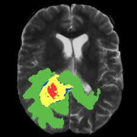
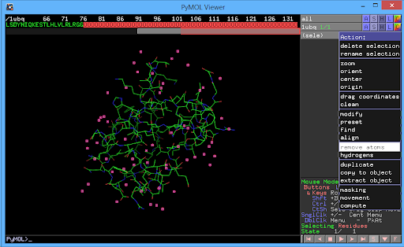
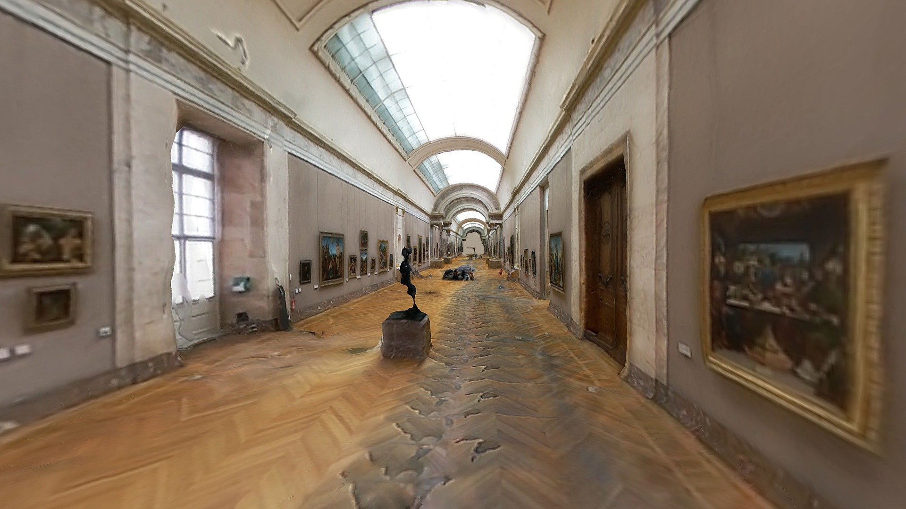
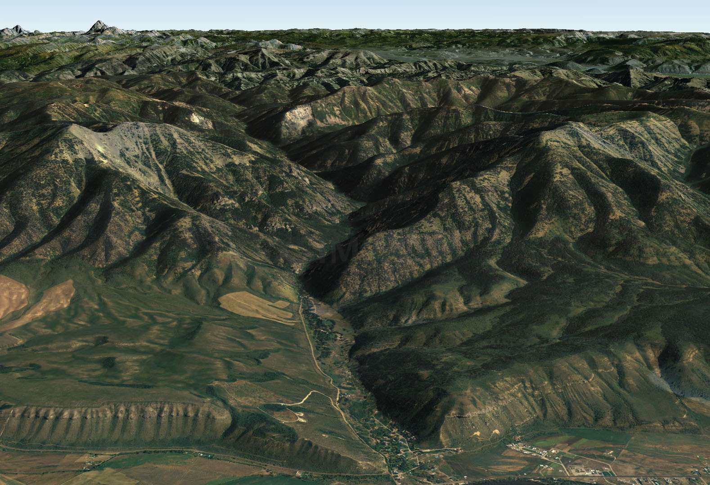
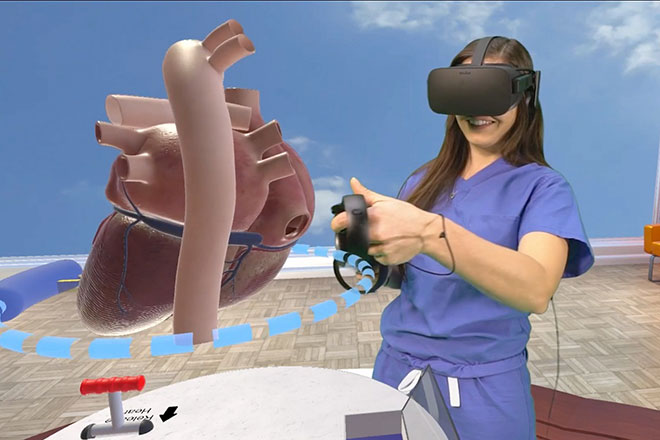
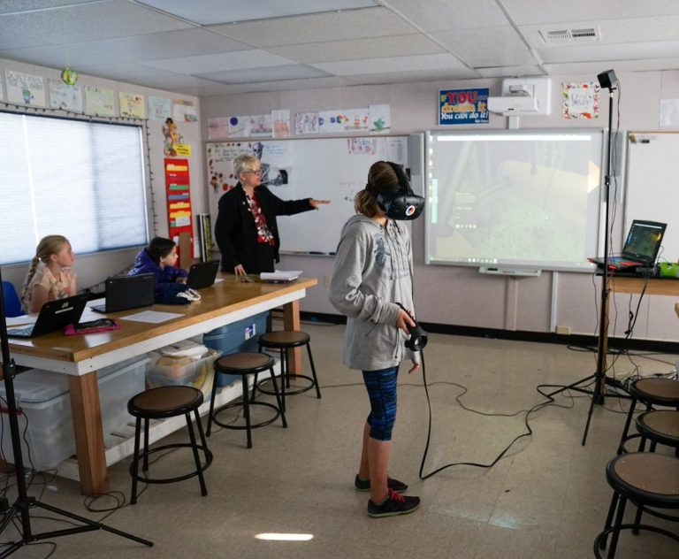

# What can you do with these data?

We present several examples on how 2D and 3D data is used by different researches and faculty. Feel free  to take them as a base to start working in your project.

## Manipulating 2D Images

#### Segmentation, registration and filtering.

Most of the times users already know the answer to this question. For example, **identifying** and **extracting** a portion of the data visualized on an image. This is the case for medical images where doctors want to study a particular section of data and identify a possible illness on the patient.

However,  manually identifying the desired region may easy to do, but to automatize the process it will require certain amount of computational power to get to comprehensive results. _Please refer to the list of software that can help you with this type of operations._

## Manipulating 3D Data.

let's suppose the data is a 3D representation of a molecule structure. Here, users like to be able to study and manipulate it in real time. Performing **translations**, **rotations**, and **scaling** the molecule's size in order to **identify** specific regions of interests in the data.

Also, the data could represent buildings, rooms or terrains. Users would like to implement some **lighting models** or just **navigate** it in a virtual environment.

The latest 3D display devices allows to showcase and interact with the data in multiple shape and flavors. Virtual Reality \(VR\) technology helps simulating the user's physical presence in a virtual environment. Meaning, a person can virtually be in front of the data and interact with it as they would do with a real physical object. This is extremely helpful if the main purpose of the data is for **training** and **education**.

Another way to visualize and study data is through Augmented Reality \(AR\). The goal of this technology is to place computer generated content in the real world in order to enhance real physical objects. 

